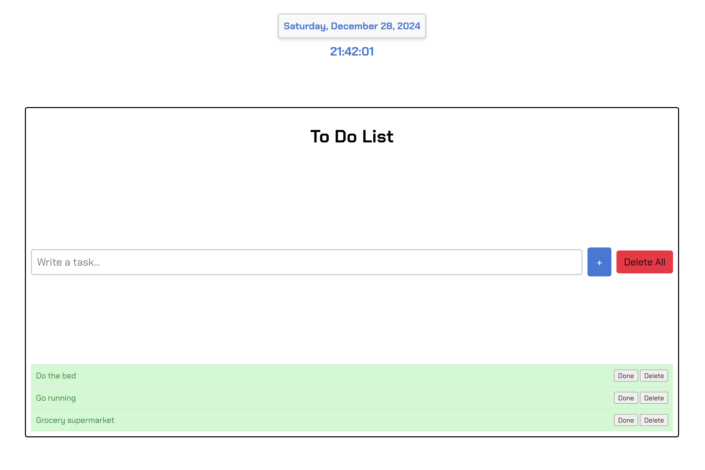

# To-Do List Application

**A minimalist and user-friendly to-do list application that allows users to manage their tasks efficiently. This application features a dynamic calendar, a dark/light mode toggle, and intuitive alerts for task management.

## Table of Contents
1. [Features](#features)
2. [Screenshots](#screenshots) 
3. [Installation](#installation)
4. [How it works](#how-it-works)
5. [Project Structure](#project-structure)
6. [Technologies Used](#technologies-used)
7. [Future Improvements](#future-improvements)
8. [License](#license)
9. [Author](#author)

---

## Features

### Core Features:
- Add, complete, and delete individual tasks.
- Clear all tasks with a single button.
- Dynamic alert messages for task actions (e.g., task completion, deletion).

### Design Features:
- Responsive and modern design.
- Dark and light mode toggle for user preference.

### Calendar and clock integration:
- A dynamic calendar displaying the current date and clock with the current time in an aesthetically pleasing format.

---

## Screenshots





--- 

## Installation

Follow these steps to clone and run the project locally:

1. Clone this repository:
   ```bash
   git clone https://github.com/PhilippeInCode/To-Do-List.git
   
2. Enter the project directory:

    cd To-Do-list

4. Open index.html in your preferred browser to launch the application

---

## Project Structure

to-do-list/

│

├── index.html    

├── style.css      

├── script.js     

└── README.md        

---

## How it works

- Adding Tasks:

Enter a task in the input field and click the "+" button or press Enter.
The task will be added to the list below.

- Completing Tasks:

Click the "Done" button next to a task to mark it as completed.
Completed tasks are visually differentiated.

- Deleting Tasks:

Click the "Delete" button next to a task to remove it.
Use the "Delete All" button to clear all tasks at once.

- Dark/Light Mode Toggle:

Click the toggle button at the top-right corner to switch between dark and light themes.

--- 

## Technologies Used

- **HTML5**: Markup structure of the application.
- **CSS3**: Styling for both light and dark themes.
- **JavaScript (ES6)**: Logic for task management, dynamic calendar, and alert functionalities.
- **[SweetAlert2](https://sweetalert2.github.io/)**: For custom and visually appealing alerts.

---

## Future Improvements

- Integration with local storage to save tasks across browser sessions.
- Addition of due dates and priority levels for tasks.
- Drag-and-drop functionality for reordering tasks.

---

## License
This project is licensed under the MIT License.

--- 

## Author

Developed by Felipe Chacón Montero
